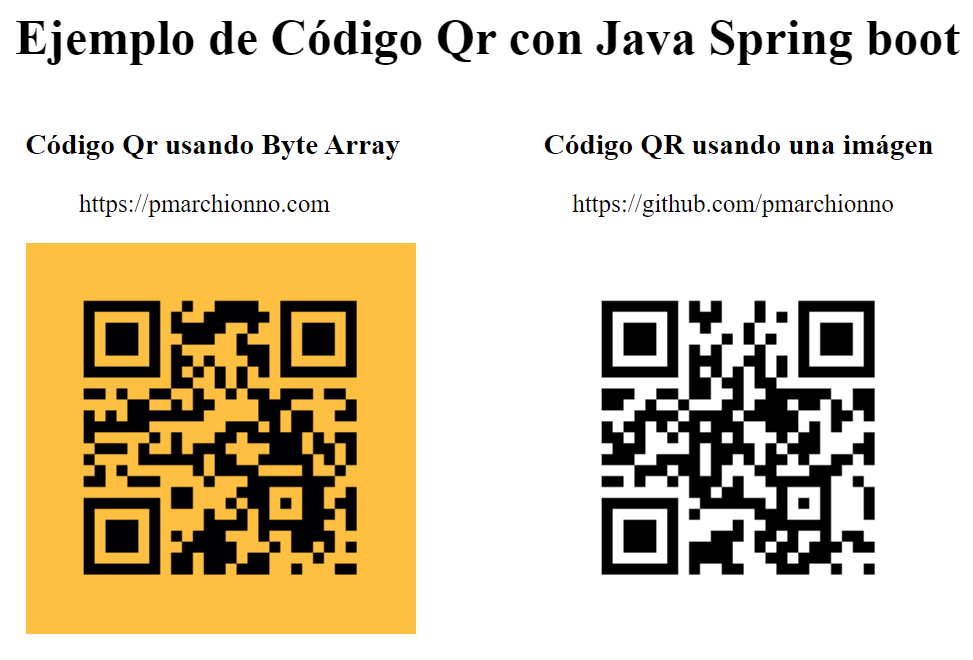

# Código QR con Java SpringBoot

### Dependencias
Iniciar el proyecto con las dependencias
- Spring Boot Web
- Thymeleaf

Agregar al archivo pom.xml
- ZXing (com.google.zxing)

#

La clase <strong><i>GeneradorCodigoQR</i></strong> contiene las funciones

<strong><i>generateQRCodeImage</i></strong>
 
&nbsp; &nbsp; Esta función se utiliza para generar el código QR en forma de imagen y guardarla en la ruta especificada.

<strong><i>getQRCodeImage</i></strong>
 
&nbsp; &nbsp; Esta función generará el código QR en forma de ByteArray.

 

El método <strong><i>getQRCode</i></strong> del controlador, invoca a la funciones creadas en la clase <strong><i>GeneradorCodigoQR</i></strong> para obtener la imagen o la matriz de bytes para el código QR.

Podemos cambiar el color del código QR especificando los colores en el objeto MatrixToImageConfig.

<pre class="me mf mg mh mi oh oi oj ok ax ol bj">
    MatrixToImageConfig con = new MatrixToImageConfig( foregroundColor , backgroundColor) ;
</pre>

### Preview

#### Fuente: https://medium.com/nerd-for-tech/how-to-generate-qr-code-in-java-spring-boot-134adb81f10d